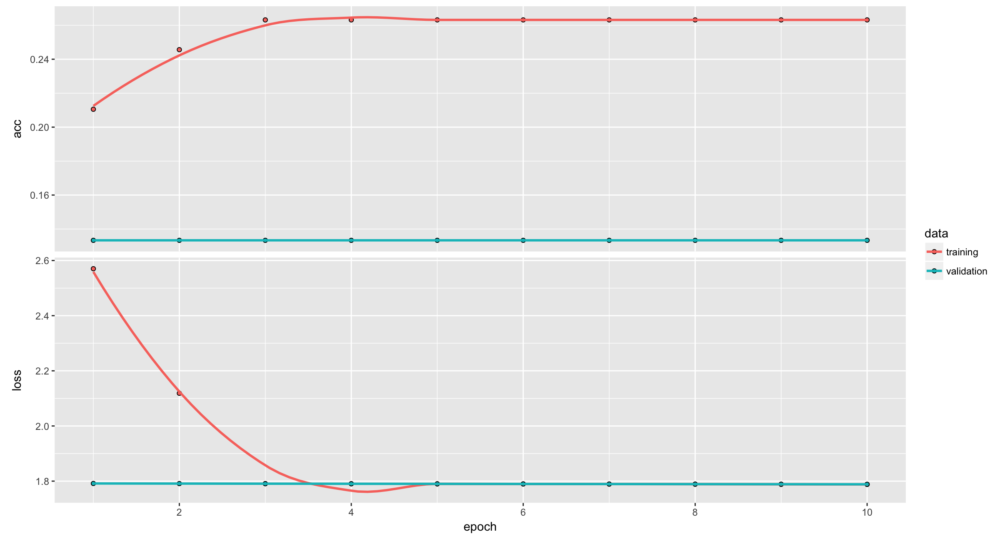

```{r setup, include=FALSE}
knitr::opts_chunk$set(echo = TRUE)
load("envlouis.RData")
load("envJB.RData")
library(caret)
library(car)
library("e1071")
library(randomForest)
library(kernlab)
library(stats)
library(MASS)
options(Encoding="UTF-8")
```

# Introduction

Dans ce TP, nous disposons de trois jeux de données. Le premier représente des expressions de visages, le second des lettres de l'alphabet et le troisième des sons. Le but est alors de trouver les meilleurs classifieurs pour ces trois jeux de données en utilisant des méthodes d'apprentissage supervisé.

# Expressions 

Ce premier dataset sur les expressions du visage contient les niveaux de gris des images de taille 60 x 70. La classification doit se faire parmi 6 labels: joie, surprise, tristesse, dégoût, colère, peur.

## Analyse

C'est un jeu de données particulier avec beaucoup plus de paramètres (4200) que d'individus dans le dataset, on n'a que 108 images en tout et pour tout. 
Cela rend donc la tâche plus complexe et le preprocessing important. Un autre aspect des données dont il va être difficile de tenir compte est la géométrie de l'image et donc la place de chaque pixel l'un par rapport à l'autre. 
En effet les algorithmes de machine learning classiques prennent des vecteurs (et non des matrices ou tenseurs) en entrée, on ne s'attend donc pas, en utilisant ces méthodes classiques, à d'excellents résultats. 
En ce qui concerne l'équilibre entre chaque classe, le nombre d'individus par classe est équilibré à l'exception de 2 classes (joy et sadness) qui ont plus d'individus que les autres. Il faudra donc voir si cette différence du nombre d'individus est significative et induit le classifieur en erreur ou non.
```{r , echo=FALSE}
data_expressions <- read.csv("data/expressions_train.txt",sep = " ")
X_expressions <- data_expressions[,1:4200]
y_expressions <-data_expressions$y

table(y_expressions)

```
## Preprocessing 

### Elimination des pixels noirs
Tout d'abord, il a fallu essayer de voir s'il était possible de réduire le nombre de dimensions du dataset.
Comme on le voit sur l'image ci dessous, il y a des zones noires sur les angles inférieurs. 
```{r, echo=FALSE,fig.height=6, fig.width=6}
image(t(I1),col=gray(0:255 / 255))
```

Ces parties noires sont présentes sur toutes les images au même endroit et résultent donc en colonnes égales à zéro dans le dataset. Puisqu'on ne tient pas compte de la géométrie de l'image, ces zones noires ne permettent pas de différencier une image par rapport à une autre (puisqu'elles sont similaires dans toutes les images), on peut donc éliminer leurs colonnes respectives dans le dataset.

```{r}
data_preprocessed <- data_expressions[, !apply(data_expressions == 0, 2, all)]
dim(data_preprocessed)
```

### Sélection des parties expressives du visage 

Une autre manière de réduire la dimension du dataset est de sélectionner les parties qui expriment l'expression du visage. Nous sommes partis de l'hypothèse que les parties les plus expressives sont celles autour des yeux et de la bouche. C'est une hypothèse forte que l'on a voulu tester et puisque les visages ne bougent pas (pas de rotation, faibles translations), il suffit de sélectionner une zone de pixels fixe pour les yeux et la bouche.
Ci-dessous, un exemple de cette sélection sur la même image qu'affichée précédemment.

```{r, echo=F,fig.height=3, fig.width=10}
par(mfrow = c(1, 2))
image(t(Ieyes),col=gray(0:255 / 255))
image(t(Imouth),col=gray(0:255 / 255))
```

### PCA

La dernière technique pour réduire le nombre de dimensions a été le PCA.
En effet avec ou sans les sélections précédentes, le nombre de features dépassait toujours le millier.
Dans chaque cas le choix du nombres de composantes principales s'est fait en traçant les courbes de proportions de la variance en fonction du nombres de composantes.
Ci-dessous le PCA exécuté après la sélection des parties expressives du visage.
```{r, echo=F}
require(graphics)

par(mfrow = c(1, 2))
plot(prop_varex, xlab = "Principal Component",
     ylab = "Proportion of Variance Explained",
     type = "b")

plot(cumsum(prop_varex), xlab = "Principal Component",
     ylab = "Cumulative Proportion of Variance Explained",
     type = "b")

```

Pour les courbes affichées nous avons choisi 25 composantes principales ce qui visuellement ainsi qu'après plusieurs tests nous est apparu comme le meilleur compromis.

## Classification 

Afin d'obtenir le meilleur résultat de classification nous avons testé plusieurs classifieurs sur différents types de vecteurs en entrée. En effet, tous les algorithmes ne réagissent pas de la même manière aux étapes de preprocessing présentées. 
Différentes combinaisons parmi ces étapes ont donc été testées en fonction des propriétés des classifieurs.

## Analyse

Au niveau du preprocessing, pour toutes les méthodes testées, les pixels noirs ont été retirés. 
Voici les résultats (la précision obtenue) pour les differentes combinaisons entre les méthodes testées et les étapes de preprocessing.

  * SVM linear: 0.73
  * SVM polynomial: 0.70
  * RandomForest: 0.73
  * Naive-Bayes: 0.70
  * RDA: 0.71
  * XGBOOST: 0.68
  
  * SVM linear+ PCA: 0.69
  * Naive Bayes + PCA: 0.69
  * RDA + PCA :0.75
  * RandomForest + PCA : 0.65
  * XGBOOST + PCA: 0.71
  
  
  * SVM linear + Sélection des zones expressives+ PCA: 0.69
  * Naive Bayes + Sélection des zones expressives+ PCA: 0.72
  * RDA + Sélection des zones expressives + PCA :0.77
  * RandomForest + Sélection des zones expressives + PCA : 0.68
  * XGBOOST+ Sélection des zones expressives + PCA: 0.71

## Observations 

Globalement, la sélections des zones expressives du visage couplée au PCA améliore les performances par rapport au PCA normal. Cela valide notre hypothèse sur le fait que les yeux et la bouche sont les zones expressives du visage et que sélectionner ces zones aide à réduire le bruit dans les données.

C'est la combinaison PCA + Sélection des zones expressives + RDA qui a les meilleures performances.

On notera que les performances des algorithmes de SVM linéaire et de random forest réagissent mal à la réduction de la dimension du vecteur d'entrée par PCA.

## Autres méthodes

Afin d'exploiter la géométrie des images, il existe des algorithmes basés sur des réseaux de neurones à convolution appelés CNN. 
Ce sont ces algorithmes qui, pendant les dernières années, ont permis d'améliorer nettement les résultats de classification d'images par rapport aux algorithmes de machine learning classique.
A l'aide de la librairie Keras, nous avons essayé de les exploiter de deux manières différentes.

### Construire un réseau CNN

Avec cette méthode on définit la structure du réseau de neurones et on l'entraîne depuis le début avec les images dont on dispose.



On se rend compte ici que le training ne se fait quasiment pas, et ce malgré une architecture relativement peu profonde.
Cela est majoritairement dû au faible nombre d'individus dans le dataset qui ne permet pas d'entrainer de tel réseau. En effet, c'est le défaut de ce genre de méthode, elles néccéssitent de grands dataset, de l'ordre de la dizaine de millier au million en fonction du nombre de paramètres en entrée et de la complexité du réseau.

### Transfer learning

Le transfer learning exploite un réseau de neurones profond déjà pré-entrainé afin de palier au petit nombre d'individus dans un dataset. 
La partie déjà entrainée joue donc le rôle de "feature extractor" sur lequel on réentraine un réseaux de neurones peu profond.

Malheureusement, avec 108 individus et 6 classes, même un réseau de neurones peu profond ne converge pas. 

On concluera donc qu'avec un dataset avec si peu d'individus, il n'est possible d'appliquer que des méthodes de machine learning classiques, ne nécéssitant pas énormément de data.
Ce qui fera la différence sur le résultat pour un méthode donnée sont les étapes de preprocessing et feature engineering qui visent ici à réduire le nombre de features du dataset et à en extraire du sens (interprétation).

## Character
### Analyse

Nous commençons dans un premier temps par analyser notre jeu de données. Grâce à la commande 'summary', nous pouvons voir que chaque élément est décrit par 16 variables quantitatives et que nos individus vont logiquement être divisés en 26 classes représentant l'alphabet. On note également que les variables semblent issues d'une loi centrée autour de 0. Enfin les individus sont repartis assez équitablement dans les differentes classes. De plus, le nombre d'individus est largement supérieur au nombre de prédicteurs, nos modèles ne devraient donc pas faire du 'overfitting'.

```{r character}
table(character_data$Y)
```

### Approche 

Pour trouver le meilleur classifieur pour ces données, nous allons appliquer plusieurs méthodes étudiées en cours. Nous pourrons alors comparer l'efficacité de ces méthodes en comparant l'erreur de chaque classifieur fournie par validation croisée. Nous allons détailler certaines méthodes ci-dessous et l'ensemble des méthodes appliquées avec leurs résultats seront présentées ultérieurement dans un tableau récapitulatif.

### Application

Dans un premier temps, nous allons appliquer simplement plusieurs méthodes conjointement avec la validation croisée pour obtenir des résultats comparables et significatifs. Nous commençons donc par diviser nos données en deux parties, un ensemble train comportant les deux tiers des données et un ensemble de test comportant le reste.
```{r echo=FALSE}
character <- read.csv("data/characters_train.txt", sep =" ")
```

```{r echo=TRUE}
n=nrow(character)
ntrain=ceiling(n*2/3)
ntst=n-ntrain
train<-sample(1:n,ntrain)
character.test<-character[-train,]
character.train<-character[train,]
```
Une fois la séparation faite, nous pouvons alors commencer à tester différents modèles pour avoir une première idée des performances de chacun. Pour cela, on entraine notre modèle sur la partie 'train' et nous prédisons nos classes sur la partie 'test'. Cependant, pour comparer les différentes méthodes il est plus judicieux d'avoir recours à la validation croisée. Nous mettons alors en place ce système qui nous permettra d'avoir des résultats plus significatifs pour comparer nos classifieurs. Nous divisons alors nos données en dix parties de même taille, à chaque itération de notre boucle nous entraînons notre modèle sur la partie des données de 'train' et ensuite nous pouvons prédire les données de test. A chaque itération un nouvel ensemble de 'test' et donc de 'train' sont utilisés. On fait alors une moyenne des résultats que nous avons obtenu pour obtenir une erreur stable et significative qu'on utilisera pour comparer nos differentes méthodes et ensuite choisir celle qui nous donne la plus petite erreur. 

Après avoir testé nos differents modèles, nous avons également mis en place une méthode de réduction de la dimension (ACP). Les données étant déjà centrées autour de 0 et avec des valeurs assez proches, nous n'avons ni besoin de normaliser ces données ni de les redimensionner avant d'appliquer l'ACP. Cette étape peut avoir l'avantage de supprimer d'éventuels redondances entre nos informations cependant on peut également perdre des informations. Il sera donc intéressant de comparer nos modèles avec et sans la phase de traitement de l'ACP.

Pour ce jeu de données, c'est le modèle du random forest qui a donné le meilleur résultat. 
```{r echo=TRUE}
n_folds <- 10
folds_i <- sample(rep(1:n_folds, length.out = n)) 
CV<-rep(0,10)
for (k in 1:n_folds) {
  test_i <- which(folds_i == k)
  train_xy <- character[-test_i, ]
  test_xy <- character[test_i, ]
  rf <- randomForest(Y ~ ., data = train_xy)
  pred_rf<-predict(rf, newdata = test_xy, type = "response")
  prop.table(table(test_xy$Y,pred_rf))
  cm= as.matrix(table(test_xy$Y,pred_rf))
  CV[k]<- sum(diag(cm)) / sum(cm)
}
CVerror= sum(CV)/length(CV)
```
En effet, pour ce jeu de données les méthodes de résolution linéaire sont moins efficaces. C'est pour cette raison que le LDA a des performances moindres comparé au random forest qui est moins dépendant des variables. De même on peut remarquer que le QDA nous donne de meilleures performances que le LDA. Ceci est probablement expliqué par le fait que les variables n'ont pas les mêmes matrices de variance-covariance. Dans ce cas, les méthodes linéaires comme le LDA sont beaucoup moins efficaces pour differencier les differentes classes. Dans ce cas de figure, les méthodes quadratiques comme le QDA ainsi que d'autres méthodes moins dépendantes de cette caractéristique comme le random forest nous donne de meilleurs résultats.

### Résultats
Voici les résultats de précision obtenus pour les differentes méthodes testées:

  * RandomForest: 0.9343
  * SVM: 0.913
  * Naive-Bayes: 0.69
  * LDA: 0.70
  * QDA: 0.88
  * RDA: 0.87
  * SVM + PCA: 0.71
  * Naive-Bayes + PCA: 0.64
  * LDA + PCA: 0.65
  * QDA + PCA: 0.68
  
Comme prévu, les méthodes simples et linéaires sont celles qui nous donnent les classifieurs les moins précis. Naive-Bayes est ici peu performant ce qui pourrait s'expliquer par une trop grande corrélation entre plusieurs prédicteurs.  
Nous avons alors ensuite ajouté une partie de traitement des données avec l'ACP. En effet, notamment pour améliorer les résultats de modèles comme Naive-Bayes nous avons appliqué l'ACP pour réduire les dimensions de notre jeu de données. Cependant, quel que soit le modèle auquel on a appliqué l'ACP, le résultat de notre classifieur devenait moins bon. Ceci s'explique par le fonctionnement de ce traitement. En effet, l'ACP prend en compte seulement les coordonnées des points de nos données. L'ACP peut donc supprimer des informations qui sont pourtant importantes pour classifier nos données. En fonction de ces dernières ce processus de construction peut mener à de mauvaises composantes n'expliquant pas bien nos classes et donc résultant en des classifieurs moins performants. C'est pour cette raison que cette phase de traitement n'a pas été maintenue pour notre classifieur final.  
Le RandomForest est très performant ici notamment car nous disposons de beaucoup plus d'individus que de prédicteurs. Ceci empêche un des risques avec ce modèle: l'overfitting. 

### Conclusion

Après le test de nos différents modèles et même de l'ajout d'une phase de traitement des données, les résultats obtenus par validation croisée nous permettent de choisir le meilleur classifieur pour ce jeu de données. Ainsi c'est le randomForest qui nous donne le meilleur résultat avec une erreur de seulement 6.6% ce qui est assez satisfaisant. Ce résultat nous laisse penser que notre jeu de données est suffisament important pour que nos modèles puissent apprendre de manière efficace les différents éléments. 


## Paroles

### Analyse

Comme pour le jeu de données précédent, nous commençons par analyser notre jeu de données avec la commande 'summary'. Nous avons donc près de 2500 individus caractérisés par 256 variables. Ces individus sont répartis dans cinq classes.  
```{r }
table(parole$y)
```
Nous pouvons voir que les différentes classes ne contiennent pas le même nombre d'individus mais les différences sont relativement faibles (entre 16 et 26%). On note également que les variables semblent issues d'une loi centrée autour de 0. Enfin, malgré notre nombre important de prédicteurs, nous disposons de suffisament d'individus pour limiter les risques d'overfitting.

### Approche

Nous allons aborder ce problème de la même manière que le précédent. Nous allons comparer différents modèles en comparant l'erreur issue de la validation croisée et pourrons ainsi choisir notre meilleur classifieur pour ce jeu de données. Nous ajouterons également une phase de traitement des données avec l'ACP puis comparerons les performances des classifieurs avec et sans cette phase.

### Application

De la même manière que pour le jeu de données précédent, nous allons créer notre boucle de validation croisée de dix itérations et à l'intérieur de celles ci nous allons entrainer et tester nos modèles.  
De même, nous avons également mis en place une méthode de réduction de la dimension (ACP). Les données étant déjà centrées autour de 0 et avec des valeurs assez proches, nous n'avons ni besoin de normaliser ces données ni de les redimensionner avant d'appliquer l'ACP.
```{r echo=FALSE}
parole <- read.csv("data/parole_train.txt", sep =" ")
n=nrow(parole)
```

```{r echo=TRUE}
n_folds <- 10
folds_i <- sample(rep(1:n_folds, length.out = n))
CV<-rep(0,10)
for (k in 1:n_folds) {
  test_i <- which(folds_i == k)
  train_xy <- parole[-test_i, ]
  test_xy <- parole[test_i, ]
  svm_train <- svm(y ~ ., data = train_xy)
  pred_svm<-predict(svm_train, newdata = test_xy, type = "response")
  prop.table(table(test_xy$y,pred_svm))
  cm= as.matrix(table(test_xy$y,pred_svm))
  CV[k]<- sum(diag(cm)) / sum(cm)
}
CVerror= sum(CV)/length(CV)
CV
CVerror
```
Ici, c'est le SVM qui nous donne le meilleur résultat.

### Analyse
Voici les résultats de précision obtenus pour les differentes méthodes testées:

  * SVM: 0.926
  * RandomForest: 0.918
  * LDA: 0.917
  * RDA: 0.903
  * Naive-Bayes: 0.88
  * QDA: 0.66
  * SVM + PCA: 0.66
  * Naive-Bayes + PCA: 0.57
  * LDA + PCA: 0.56
  * QDA + PCA: 0.63
  
On remarque ici que quatre modèles ont des performances très similaires à savoir SVM, RandomForest, LDA ainsi que RDA. D'après les résultats, c'est le SVM qui est le meilleur classifieur pour ce jeu de données. Cependant, on voit que le LDA a un score très proche or il est souvent plus simple d'interpréter les résultats avec le LDA qu'avec le SVM. Pour ce TP, nous allons tout de même garder le meilleur score pour notre classifieur puisqu'on cherche le classifieur le plus précis possible.
On peut remarquer qu'ici aussi en ajoutant une phase de traitement des données avec réduction des dimensions grâce à l'ACP, les performances des classifieurs sont diminuées. Encore une fois, ceci s'explique probablement par de la perte d'informations lors de la création des composantes.  
SVM est très efficace grâce aux transformations qu'il opère sur nos données pour détecter des relations entre nos variables et ainsi détecter plus facilement les liens entre les valeurs des paramètres de nos individus et nos classes. Cependant, cette algorithme rend l'interprétation des résultats plus compliquée. C'est pour cette raison que dans ce cas présent, le LDA serait probablement préféré pour expliquer les données plutôt que le SVM. De plus, nous disposons ici de beaucoup de prédicteurs et d'individus, SVM est particulièrement efficace dans ce contexte où il peut exister de nombreuses relations entre les différents éléments.

### Conclusion

Après avoir testé différents modèles pour ce jeu de données et mis en place une phase de traitement des données, les résultats obtenus par validation croisée nous permettent de choisir le meilleur classifieur. Ainsi c'est le SVM qui nous donne le meilleur résultat avec une erreur de seulement 7.4% ce qui est assez satisfaisant. Le nombre important d'invidus pour entraîner nos modèles nous a permis d'obtenir des résultats plutôt satisfaisants pour les différentes méthodes.


